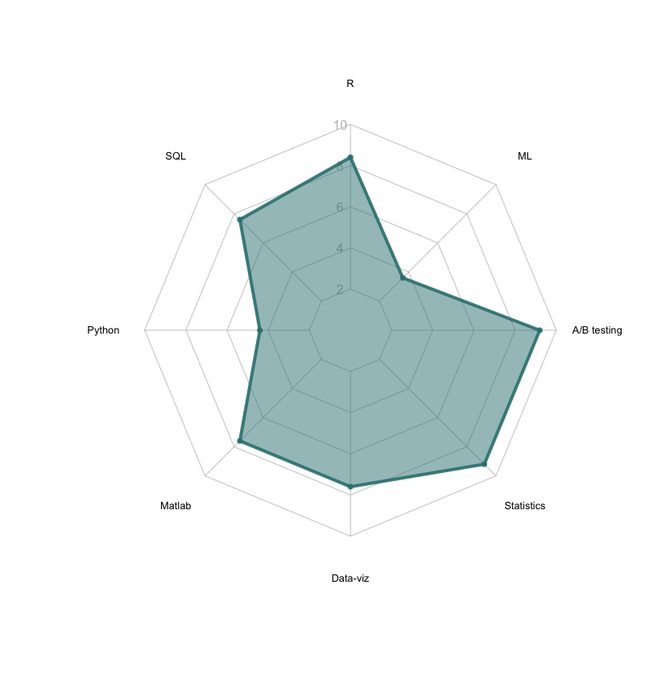

Data Science Portfolio
----------------------

Thank you for your interest in my data science portfolio. This is a
repository that contains data science projects completed by me for self
learning and/or academic purposes. This collection isn’t a exhaustive
list of projects more like means to showcase certain skills I can use
reliably - presented in the form of R (and markdown), Python (to be
added), Matlab and SQL scripts. If you have any questions or want to
collaborate please feel free to reach out to me on
[LinkedIn](https://www.linkedin.com/in/lilla-hodossy/).

I would illustrate the current level of my skill set in the following
way:

Of course, I always aim to develop my skills further and throughout the
years I proven that I have the dedication to adapt to situations and
teach myself new skills when needed.

Deep dives
----------

### Business problems using simulated data-sets

For me it is important to find a balance between speed and accuracy for
every analysis. According to my experience in industry, sometimes a
good-enough answer within an hour is more valuable than the perfect
solution within days or months of work. For this reason, below I am
showcasing analyses I can do with less or more time, using 2 made up
business questions on 2 distinct data sets I haven’t seen prior to the
analysis

Methods used in both exercises:

1.  Exploration of data distribution

2.  Data aggregation and wrangling using *dplyr*

3.  Data visualization using *ggplot2*

4.  Linear regression using categorical and continuous data

5.  Automatisation of formating using R mark down and *knitr*

**What can I do within 8 hours ?**

This analysis explores the impact of joining the subscription programme
on a business that cares about customer ordering frequency and value
(see [R
markdown](https://github.com/HoLilla/Portfolio/blob/master/Industry_exercise/portfolio1.Rmd)
or
[pdf](https://github.com/HoLilla/Portfolio/blob/master/Industry_exercise/Portfolio1.pdf)
versions).

**What can I do within 1-1.5 hour(s)?**

This analysis explores what actionable insights can be reached for a
business based on some sales data (see [R
markdown](https://github.com/HoLilla/Portfolio/blob/master/Industry_exercise/Portfolio2.Rmd)
or
[pdf](https://github.com/HoLilla/Portfolio/blob/master/Industry_exercise/Portfolio2.pdf)
versions).

### Academic projects

During my PhD in Cognitive neuroscience I enjoyed applying different
analytic methods, followed high standards in the reproducibility and
transparency of my projects by producing fully [reproducible
manuscripts](https://github.com/HoLilla/Hodossy-Tsakiris-2019/blob/master/Hodossy_Tsakiris_after_reviews.Rmd)
that have the data analysis embedded within the text.

I also coded in Matlab a live animation of a [biofeedback
bar](https://www.youtube.com/watch?v=Irc-ZeKeUUY) that was moving in
response to people’s heart rate changes. See a version of the script
[here](https://github.com/HoLilla/PhD_Study5/blob/master/study5_v2.m).

Throughout my academic years I also acquired and deployed more advanced
statistical techniques like linear mixed effects (LME) modeling, Monte
Carlo simulation, Area under the receiver operating characteristic curve
(AUROC) and logistic regression, non-parametric time series analysis. I
can provide example scripts of these skills on request.

I also make sure that I optimise and automatise my workflow wherever
possible for instance these
[randomisation](https://github.com/HoLilla/PhD_Study5/blob/master/condition_randomisation.R)
and
[scoring](https://github.com/HoLilla/PhD_Study5/blob/master/scoring_study5.m)
algorithms, the latter which automatically reads in files in its
directory (following a pattern) and calculates scores based on the
stored data.

SQL
---

In my current role I use SQL on a daily basis interacting with Snowflake
through DataGrip and R. As part of my current main project I
productionised code for creating and updating a data table on a daily
basis that categorises consumers into segments based on their ordering
behaviour. As this project is part of the NDA with my company I cannot
share the code, but it includes steps of data wrangling and aggregation
based on set time periods and other grouping factors, different types of
joins, and case when functions.

Communication of Results
------------------------

For me data analysis doesn’t stop at getting the results as I believe
that the results should also be communicated by picking a tone and level
of complexity that matches the audience.
[Here](https://www.sciencedirect.com/science/article/pii/S0010027719302264?casa_token=jMCs-TjFFgYAAAAA:469e8Fm5YXTnI_BsSvKw5Gz7ZSgsiCG0yTNDjWM0sWvUYGIFtTNko7WHg-O-FBGDF4Gj_121XXw#f0010)
you can access one of my published papers in a high impact journal.
While a peer reviewed journal is one of the most scientifically rigorous
version of communication, to reach a wider audience I think it is
important to create accessible versions of the same content like in the
form of a [video](https://www.youtube.com/watch?v=f_3z9lXBJzw) or a
[twitter
thread](https://twitter.com/Lilla_Hodossy/status/1174291708697333760)
etc.

I applied this approach in my current position too where I communicated
the results of a deep dive with the wider business in the form of a
Workplace post and a short video. The response was very supportive and
helped with making sure that outcome of the analysis will have impact on
future business decisions.

Experimentation, A/B testing
----------------------------

Normally I follow the structure below when designing A/B tests:

1.  Define A and B groups, the level of randomisation, the outcome
    variables we wish to measure and the analysis we plan to run on the
    gathered data.

2.  Run a power analysis (e.g. see [R
    markdown](https://github.com/HoLilla/Portfolio/blob/master/Industry_exercise/power.Rmd),
    [pdf](https://github.com/HoLilla/Portfolio/blob/master/Industry_exercise/power.pdf))
    to estimate the size of the sample the experiment needs to make
    valid conclusions. Power analysis is important because we only want
    to run the A/B as long as we gather enough data to make valid
    conclusions for the business.

3.  Monitor that data is coming in properly (e.g. check feature flags).

4.  Start analysis only when the we reach the sample size, or correct
    for the family-wise error rate when stopping data collection more
    than once. The latter one is important that because the possibility
    that we find a result by chance the more times we repeat the
    analysis on different parts of our sample.
